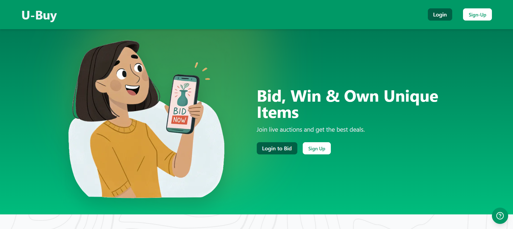
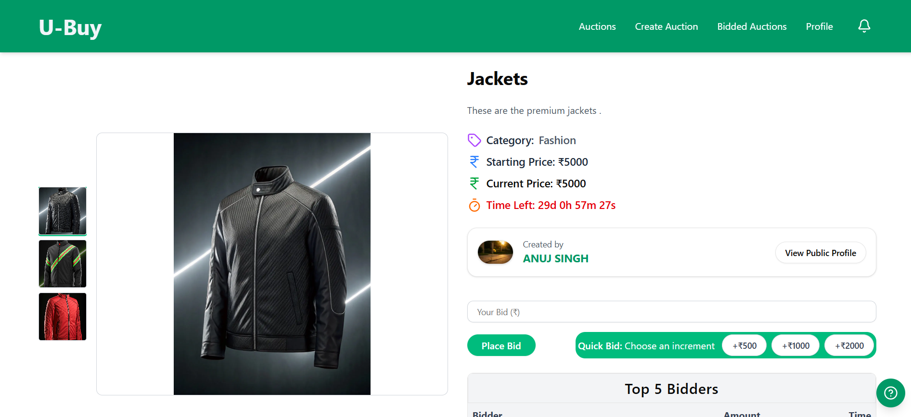
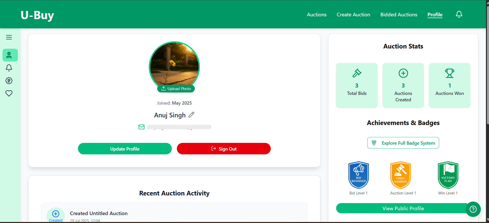

# 🛒 Ubuy – Real-Time Auction Platform


**Ubuy** is a frontend app for a backend-driven auction platform where users can bid, win, and manage listings. It focuses on a thin Next.js UI layer, authenticated backend API calls, and a polished responsive experience.

---

## 🚀 Live Features

- 🔁 **Real-Time Auction Updates** via backend socket events
- 💰 **Cashfree Payment Integration**
- 🔐 **Full Authentication** with Google and Credentials (NextAuth)
- 🎞️ **Live Auction Carousel** (Swiper.js)
- 📦 **Auction Lifecycle**: Create → Bid → Win → Pay
- 🧑‍💼 **Role-Based Access**: User & Admin/Auctioneer
- 🛑 **Owner-Only Close Option** for auctions
- 📲 **Responsive Design** with microinteractions
- 🎨 **Framer Motion Animations & Lucide Icons**
- 📧 **Newsletter Subscription** with SMTP Email support
- 📡 **Backend-Driven Uploads** for auction images and profile media
- 🧠 **Form Validation** with React Hook Form & Zod
- 🧑‍💻 **Admin Dashboard** for auction moderation and stats

---

## 📸 Screenshots

> \_Screenshots go here.

| Homepage                        | Auction Detail                      | Dashboard                                 |
| ------------------------------- | ----------------------------------- | ----------------------------------------- |
|  |  |  |

---

## 🧱 Tech Stack

| Layer    | Tools & Libraries                                  |
| -------- | -------------------------------------------------- |
| Frontend | Next.js 15 • TypeScript • Tailwind CSS • ShadCN UI |
| Backend  | Backend API • Next.js route handlers               |
| Data     | Backend-owned persistence                         |
| Auth     | NextAuth.js (Google + Credentials)                 |
| Realtime | Backend Socket.IO events via client subscription   |
| UI/UX    | Framer Motion • Lucide Icons • Swiper.js           |
| Forms    | React Hook Form • Zod • @hookform/resolvers        |
| Media    | Backend upload API                                 |
| Email    | Backend email flows                                |
| CAPTCHA  | Cloudflare Turnstile (via react-turnstile)         |
| Payments | Cashfree                                           |

---

## 🧪 Getting Started

### 1️⃣ Clone & Install

```bash
git clone https://github.com/Anuj-0-3/Ubuy.git
cd Ubuy
npm install
```

---

## 👨‍💻 Developer

**Anuj Singh**  
[](https://github.com/Anuj-0-3)  
[](https://www.linkedin.com/in/anujsinghdevx/)
